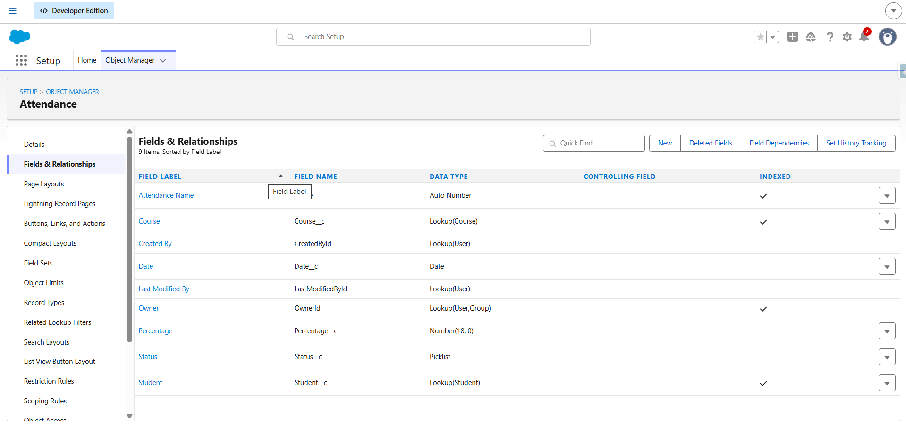
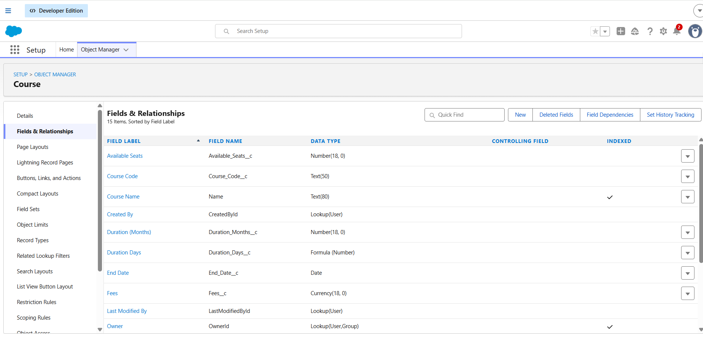
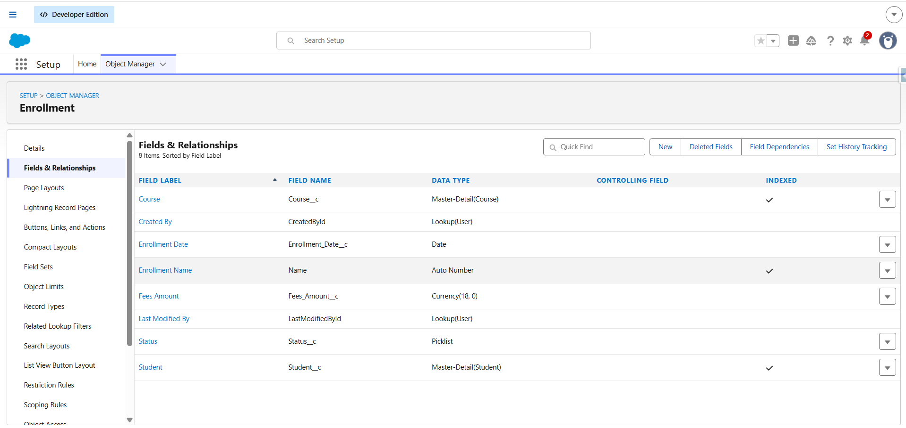
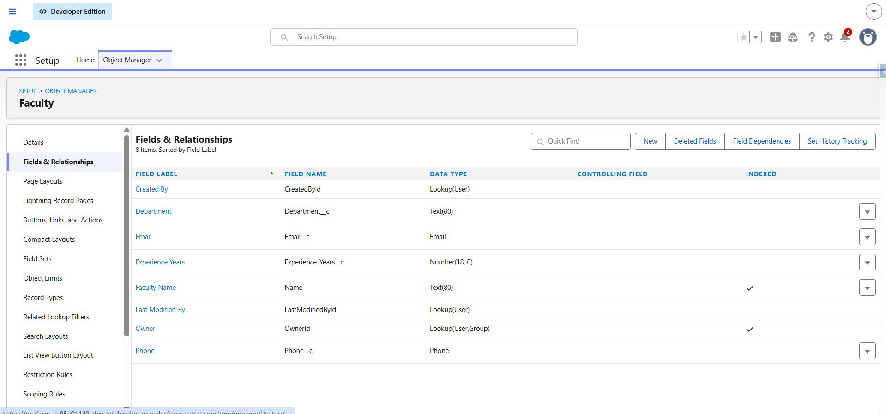
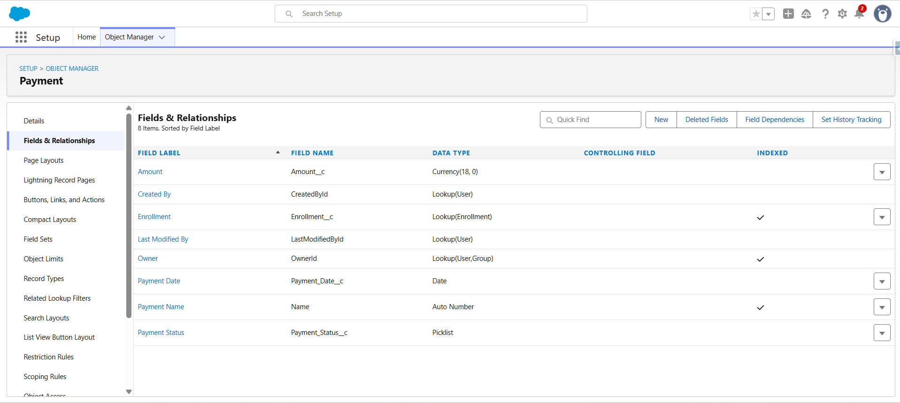
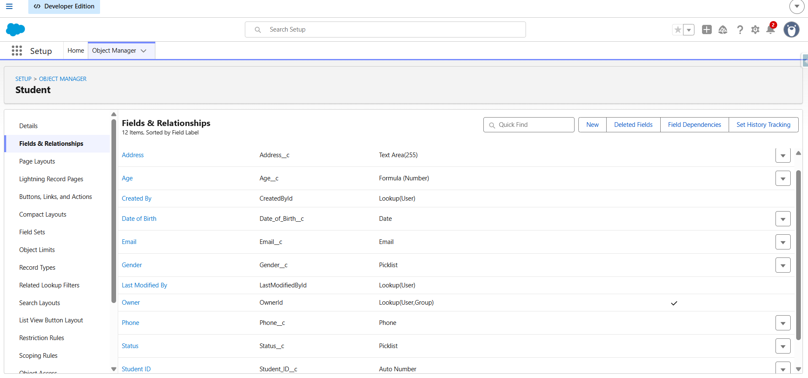
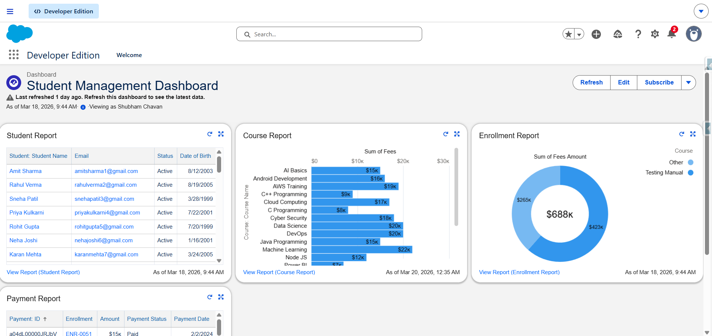
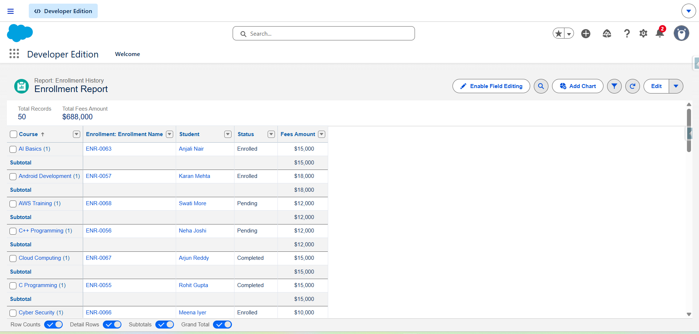
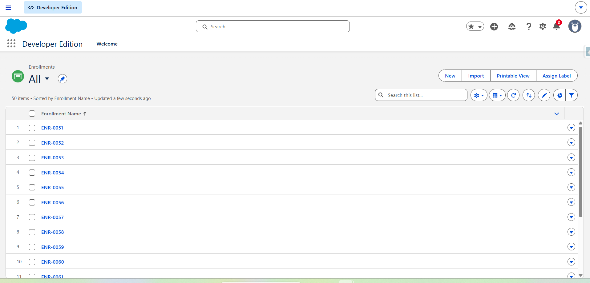

# Student Management System – Salesforce Project

## 📌 Project Description
This is a Salesforce Developer project created using custom objects, relationships, validation rules, reports, and dashboard.

The project manages students, courses, enrollments, payments, and attendance.

## 📌 Objects Created
- Student__c
- Course__c
- Enrollment__c
- Payment__c
- Attendance__c
- Faculty__c

## 📌 Features
- Student Enrollment System
- Course Management
- Payment Tracking
- Attendance Tracking
- Validation Rules
- Reports
- Dashboard with charts
- Lookup Relationships
- Page Layout customization

## 📌 Relationships
- Student → Enrollment
- Course → Enrollment
- Enrollment → Payment
- Enrollment → Attendance

## 📌 Validation Rules
- Check Seats in Course
- Check Payment Amount

## 📌 Reports Created
- Enrollment Report
- Course Report
- Payment Report

## 📌 Dashboard
- Enrollment Widget
- Course Chart
- Payment Chart

## 📌 Tools Used
- Salesforce Developer Edition
- VS Code
- Salesforce CLI
- GitHub

## Screenshots

### Attendance Object

### Course Object

### Enrollment Object

### Faculty Object

### Payment Object

### Student Object

### Dashboard

### Report

### Records

## 📌 Author
Shubham Chavan